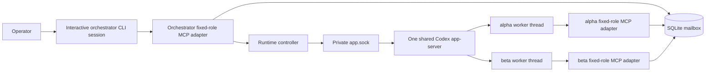

# 架構

Codex Project Orchestrator 讓一個 orchestrator 協調多個彼此獨立的專案 worker。每個 worker 都有自己的工作目錄、Codex thread 與 permission profile，但所有 worker thread 由單一共享 app-server 承載。互動式 orchestrator 則是另外啟動的 Codex CLI client/session；它不直接把另一個專案掛進自己的工作階段。專案 ID 由 operator 設定，例如 `alpha`、`beta`。

## 元件

- **Orchestrator session**：拆解已授權的工作、派送任務、核對 worker 回報，並區分 queued、running、reported、verified 與 accepted。
- **Worker session**：每個 worker 是共享 app-server 內的獨立 Codex thread，在自己的註冊 repo 與 permission profile 中執行一項有界任務。`alpha` 無法藉由 mailbox 冒充 `beta` 或讀取 `beta` 的 inbox。
- **Codex app-server**：單一 operator 啟動的服務承載所有 worker thread。Runtime controller 只透過私有 runtime state 內的一個 Unix domain socket `app.sock` 與它溝通。共享服務不表示 worker 共享 thread、cwd 或 permission profile。
- **Role-bound MCP adapter**：每個 orchestrator 或 worker session 各自連到以固定身分啟動的 adapter。呼叫者不能用任意參數改換角色；adapter 只把允許的動作轉成 app-server 或 mailbox 操作。
- **SQLite mailbox**：持久保存任務與回覆。sender、recipient 與 task ID 形成唯一鍵；完全相同的重送會取得原訊息，內容不一致的重送會被拒絕。acknowledgement 是獨立、持久的狀態。

本專案不依賴 Agent Mail，也沒有引用或移植 Agent Mail 的程式碼。訊息傳遞由本套件自己的 SQLite mailbox 與 role adapter 完成。

## 任務生命週期

1. Operator 在外部建立設定，註冊 orchestrator workspace 與 worker repo。
2. Operator 啟動一個共享 worker app-server；runtime controller 透過唯一的私有 `app.sock` 管理其中彼此獨立的 worker thread。互動式 orchestrator 另外以 Codex CLI client/session 啟動。
3. Orchestrator 送出包含唯一 task ID、目標、允許動作、限制、證據與完成條件的任務。送入 mailbox 只代表 queued。
4. 對應 worker 被啟動或喚醒，從自己的 inbox 取得任務，並在自己的 session 與權限範圍內工作。
5. Worker 以相同 task ID 回覆；mailbox 只接受確實曾送給該 worker 的 task correlation。
6. Orchestrator 讀取回覆、核對實際證據並保存需要的結果，之後才 acknowledge。回報不等同於驗證或 operator 驗收。

## 設定與 session 邊界

預設 `isolated` 模式由 operator 擁有的獨立 `CODEX_HOME` 產生角色 profile。它不繼承日常 Codex home 中的 connectors 或 plugins。註冊專案標成 untrusted，因此不載入專案自己的 Codex config；任務仍會讀取 repo 內的 `AGENTS.md` 工作指示，但這些文字不能自行擴大 runtime 權限或 operator 授權。

`local` 模式是明確選擇的完整存取模式，只應由 operator 透過專用 CLI flag 啟用。模式或 permission profile 改變後，需要停止既有角色並用新 session 重啟；現有 session 不會熱切換成新邊界。

## 交付語意

Mailbox 提供持久佇列、task correlation、冪等的相同訊息寫入與持久 acknowledgement。它不保證工作 exactly once。若 app-server 或 worker 在外部副作用發生後、回報寫入前崩潰，結果可能處於不確定狀態。系統不應自動重試這類動作；orchestrator 必須先比對外部證據，再決定是否續作。

目前整合目標為 Codex `0.154.0`，所使用的 app-server API 仍屬實驗性介面，後續版本可能需要調整。初始測試平台為 macOS；Linux 尚未驗證。
